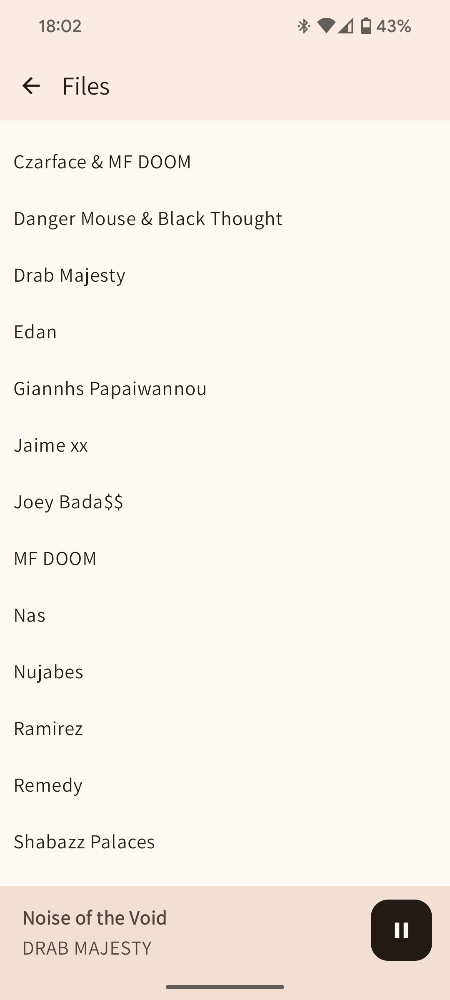
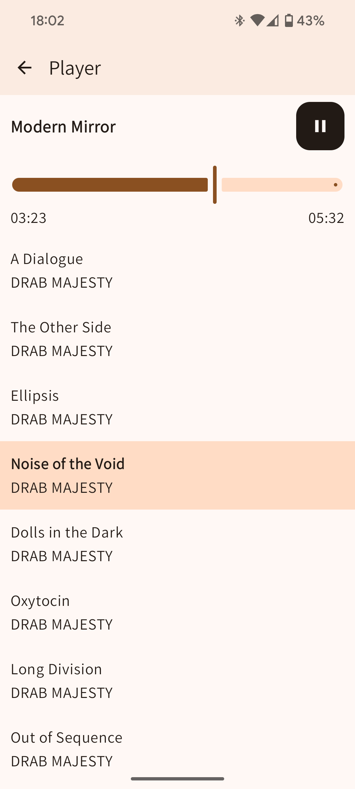

# MP3 Player

Renders and plays music found in your Android device's `Music` directory. 




## Example directory structure

Organize your music by Artists > Albums > Song. Tapping on any song would load all songs in that directory into a playlist.

```
/Music
├── The Beatles
│   ├── Abbey Road
│   │   ├── 01 - Come Together.mp3
│   │   ├── 02 - Something.mp3
│   │   ├── 03 - Maxwell's Silver Hammer.mp3
│   │   └── ...
│   ├── Revolver
│   │   ├── 01 - Taxman.mp3
│   │   ├── 02 - Eleanor Rigby.mp3
│   │   ├── 03 - I'm Only Sleeping.mp3
│   │   └── ...
├── Daft Punk
│   ├── Discovery
│   │   ├── 01 - One More Time.mp3
│   │   ├── 02 - Aerodynamic.mp3
│   │   ├── 03 - Digital Love.mp3
│   │   └── ...
└── Radiohead
	├── OK Computer
	│   ├── 01 - Airbag.mp3
	│   ├── 02 - Paranoid Android.mp3
	│   ├── 03 - Subterranean Homesick Alien.mp3
	│   └── …
```

## Motivation

I miss the early 2000's when I had an ipod. Today's mp3 player options are subpar. They are
full of proprietary buggy software, or are very expensive. 

The default music manager for android is also annoying. It's a lot of taps to just find
the Music directory. 

The MP3 player options in the app stores also come with ads. 

So after exhausting my options, I am building my own mp3 player app. 
